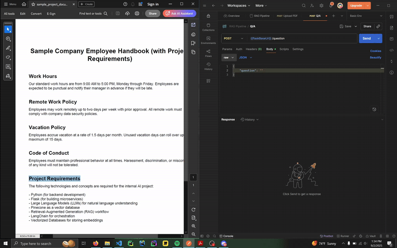
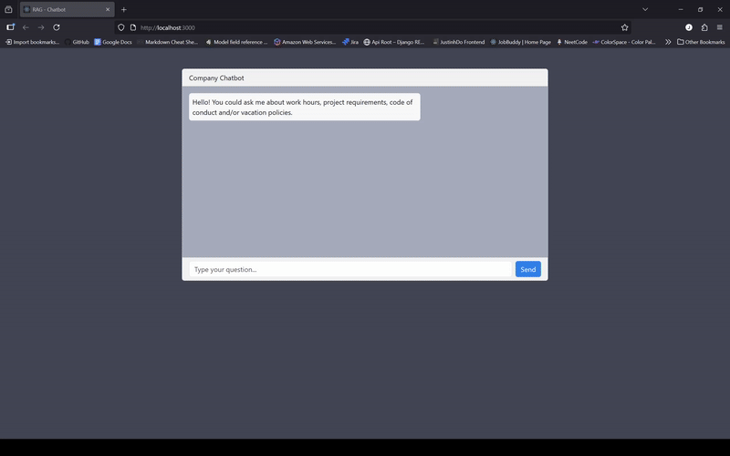

# Company Handbook Q&A with RAG Workflow

## Objective

Our primary objective is to leverage Retrieval-Augmented Generation (RAG) workflows to create a robust Question & Answer (Q&A) system based on company project documents. This approach enables users to query project documentation and receive accurate, context-aware answers powered by advanced language models.

## Tech Stack

- **LLM (Large Language Model):** For natural language understanding and generation.
- **LangChain:** Framework for building applications with LLMs and integrating external data sources.
- **RAD:** Rapid Application Development tools to accelerate prototyping and deployment.
- **Pinecone:** Vector database for efficient document retrieval and semantic search.
- **Flask** Microservice testing API Endpoint with Postman 

## Workflow Overview

1. **Document Ingestion:** Company project documents (e.g., PDFs) are processed and embedded.
2. **Indexing:** Embeddings are stored in Pinecone for fast similarity search.
3. **Query Handling:** User questions are interpreted by the LLM via LangChain.
4. **Retrieval:** Relevant document sections are fetched from Pinecone.
5. **Answer Generation:** The LLM generates answers using both retrieved context and its own knowledge.

## Getting Started

1. Place your company project documents in the designated folder.
2. Run the ingestion script to index documents in Pinecone.
3. Use the Q&A interface to ask questions about your projects.

## Benefits

- Accurate, context-aware answers
- Scalable to multiple documents and projects
- Easy integration

## Development Phase 

### 08/28

**Getting Started**
`pip install flask; flask-restful`

We create our own basic resource:

```py
class Upload(Resource):
    """
        This View will handle posting PDF to our Pinecone Vectorized Database for embeddings 
    """
    def post(self):
        pdf_file = request.files['file']

        # Need a package to convert pdf_file into a readable python object
        pass
```

But we need a package to handle our PDF 
- `pip install PyMuPDF`

```py
# Updating our post method to read the pdf files 
from flask import request 
import fitz

def post(self):
    file = request.files['file']

    # Opening our pdf file with PyMuPDF
    file_content = fitz.open(stream=file.read(), filetype='pdf')

    # Looping through the pages and reading the text 
    text = ""
    for page in file_content:
        text += page.get_text()
```

**Langchain + Pinecone Config**

`pip install pinecone langchain langchain-pinecone langchain-openai`

**Building our requirements for Pinecone**
```py
# Initializing Pinecone + Index 
from pinecone import Pinecone 
from langchain_openai import OpenAIEmbeddings

PINECONE_API_KEY = os.getenv("PINECONE_API_KEY")
# Create index on pinecone website
INDEX_NAME = 'INDEX-NAME'

pc = Pinecone(api_key=PINECONE_API_KEY, environment='us-east-1')
# Make sure the embedding is the same model as your index 
embeddings = OpenAIEmbeddings(model="text-embedding-3-small")

```

---

**Langchain Text Splitter and Prepping text for Vector Store**
```py
# Vectorizing our text for our vectorstore
#  
# In your post method....
from langchain.text_splitter import RecursiveCharacterTextSplitter 

splitter = RecursiveCharacterTextSplitter(chunk_size=800, chunk_overlap=100)
pdf_splitter = splitter.create_documents([text])    # Remember your text object is from our PDF reader => fitz
```

---
**Ingesting splitter text to Pinecone**

```py
from langchain_pinecone import PineconeVectorStore

vectorstore = PineconeVectorStore.from_documents(
    documents=pdf_splitter,
    # These two were already defined outside of our post method 
    embedding=embeddings,
    index=INDEX_NAME
)
```

### 08/29

**Testing PDF Submission**
- Run up our Flask Service 
- Postman POST request on our endpoint
- Send a file and check pinecone vectorized database

**Setting up Flask**

`set FLASK_APP=handbook_microservice.main:app`

---

`flask run`

**OpenAI API KEY**

> The problem here is that we must export or have an OpenAI API key in our environment 
>
> so we just need to go to [Open AI](https://platform.openai.com/api-keys) then grab a secret key from there 
>
> You may need to add some credits to begin the playground


**POSTMAN**

> To test we just need to send a **form-data** with a key of `file` type: File with our pdf 
>
> Send the POST request to this endpoint
>

**ERROR: Vector dimension 1536 does not match the dimension of the index 512**
- You have to make sure your Pinecone dimensions match with your OpenAI embedding
- Since the embedding cannot change or support **512** you could create a new Pinecone index with a **1536** dimension 
  - Be sure to keep the model as is: `text-embedding-3-small`

**Progress**

> We have successfully **split, embedded and ingested** our pdf document

### 09/02

**Query Pinecone - Endpoint**
1) Use OpenAI to convert question to embedding
2) Query Pinecone with embedding 
3) Use LLM to Answer the question based on context (embeddings from Pinecone )

**Question to Embedding**

*Establish an OpenAI Client*
```py
from openai import OpenAI 

# Input your key for OpenAI 
client = OpenAI(api_key='my_api_key')

# Fetch your question in Resource 
class LLM(Resource):
    def post(self):
        resp = request.get_json()
        q = resp['question']

# Changing question into embedding via OpenAI 
def post(self):
    ....
    q_embedding = client.embeddings.create(
        # Be sure to have the same embedding model as your Pinecone DB
        model='text-embedding-3-small',
        input = q
    )
```


*Querying from Pinecone*
```py
pc = Pinecone(api_key='my_pinecone_api_key')
index = pc.Index('MY_INDEX_NAME')

pinecone_query = index.query(
    # Response object so we need to access the embedding key
    vector = q_embedding.data[0].embedding,
    # Change this top 5 for different results
    top_k = 5
    include_metadata = True
)
```

*Building Context for LLM*
```py
# Queries has the "matches" key so we just loop through all the matches 
#
# Then find the text within metadata 
matches = [m["metadata"]["text"] for m in pinecone_query['matches']]

# Convert list to string for our prompt 
matches_str = "\n\n".join(matches)
```

*Creating our LLM Prompt* 
```py
# Passing in the Pinecone Query + RAW Question from our user 
prompt = f"""
You are an assistant with access to the following context from a document:

{matches_str}

Answer the question based only on the above context.
Question: {question}
"""
```

*Using OpenAI LLM*
```py
llm_resp = client.chat.completions.create(
    model='gpt-4o-mini',
    messages={'role':'user', 'content':prompt}
)

# Returning the text 
print(llm_resp.choices[0].message.content)
```

### Demo 




### 09/03

**Created Frontend**
- need *flask cors* to allow frontend service to send requests to our microservice 

`pip install flask-cors`

**Import Cors**

```py
from flask_cors import CORS 

app = Flask(__name__)
CORS(app)
```

We want to **whitelist** a certain domain to a specific resource:

```py
CORS(app, resources = {
    "/question": {"origins": REACT_ENDPOINT}
})
```
- The **key** is our endpoint and the **value** contains our url


